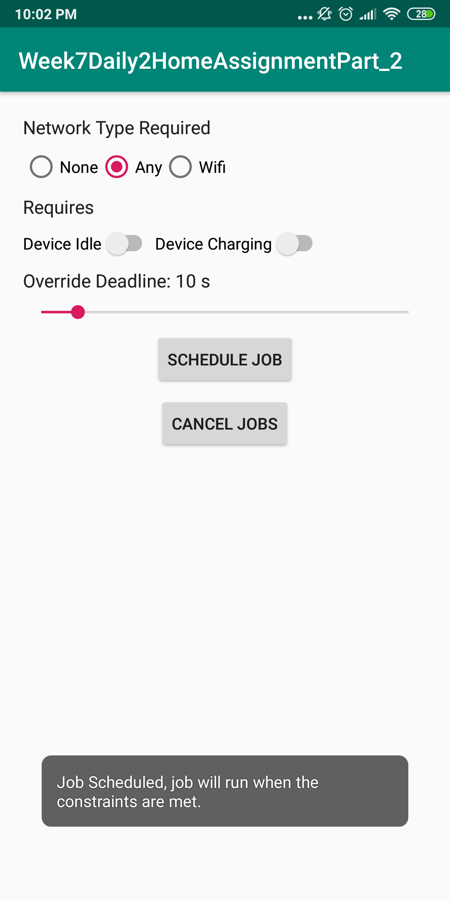

# Week7Daily2HomeAssignmentPart_2
Android app using jobscheduler

After the app start.

When any network type selected and job scheduled.

When canceled all.

When network type and override set.

When network type, device status and override set.

Showing notification in notification bar.

